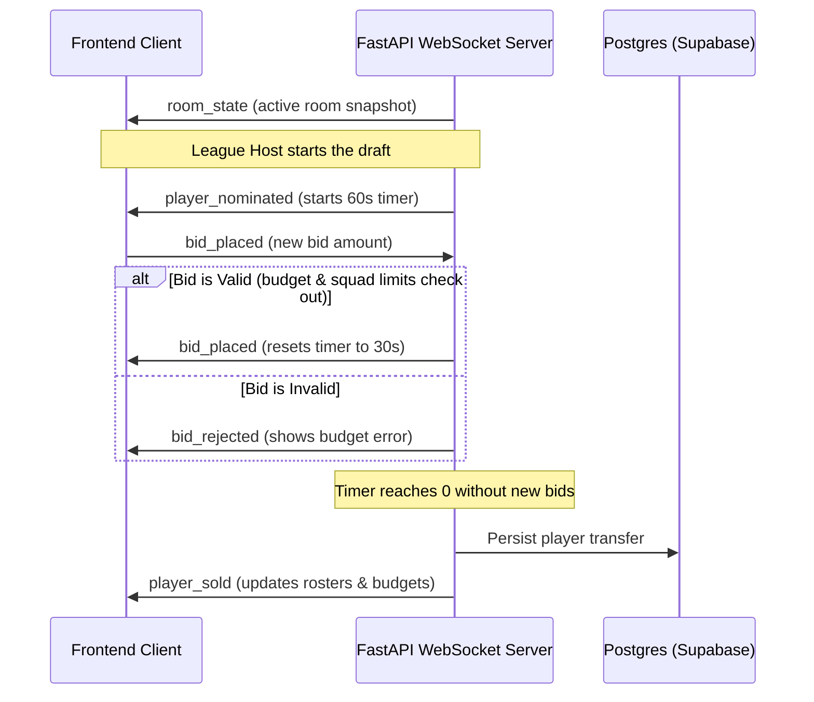

# ⚽ FIFA World Cup 2026 Simulation & Auction Platform — Frontend

Welcome to the frontend application for the **FIFA World Cup 2026 Intelligence Platform**. This is a high-performance, real-time single-page application (SPA) built for football enthusiasts to interact with complex simulations and run live fantasy drafts, and for developers to explore modern full-stack engineering patterns.

---

## 🏆 For Football Fans: What Can You Do Here?

If you live and breathe football, this platform is your ultimate playground. Here are the core features built to simulate the drama of the World Cup:

### 1. 🔨 Real-Time Fantasy Auction Room
* **Build Your Dream Squad:** Nominate and bid on a verified pool of **exactly 1,191 unique World Cup players** (complete with real-world stats, current market values, and national team info).
* **Live Action Bidding:** Enter a lobby, join a league room, and participate in server-authoritative live auctions.
* **Smart Budget Management:** Feel the pressure of the clock! You have a strict budget limit and position caps (e.g., must have a valid goalkeeper, and can't overload on forwards) enforced in real time.

### 2. 🔮 Monte Carlo Tournament Simulator
* **Simulate the Bracket:** Watch the entire 48-nation FIFA World Cup 2026 play out. See the group stage standings update dynamically, and follow the drama of knockout stages through extra time and penalty shootouts.
* **Match Engine Realism:** Outcomes are determined by team ratings (Elo, Attack/Defense metrics) powered by the backend. You can toggle stochastic mode to introduce Poisson-sampled realistic goals and see how upsets happen!
* **Run at Scale:** Execute singular tests or batch runs to calculate qualification percentages and determine who has the highest probability of lifting the trophy.

### 3. 🎮 "Play As Team" Career Mode
* **Take Command:** Pick your favorite national team (e.g., Argentina, France, Japan, or underdogs like Jordan).
* **Make Key Decisions:** Manage your squad list, set tactical preferences, and run customized simulation runs to chart your specific country's path to glory or heartbreak.

### 4. 📊 Team Analytics & Match Predictions
* **Win Probability Matrices:** Compare any two national teams head-to-head and see who is favored.
* **ECharts Analytics:** View beautiful charts plotting team forms, Elo progression, and defensive/offensive strengths using a custom **Smart Score** indicator.

---

## 💻 For Technical Developers: The Architecture & Under-The-Hood

This client is engineered as a modern, reactive TypeScript SPA. It is designed to scale and communicate efficiently with the FastAPI backend.

### 🛠️ Core Tech Stack
* **UI Library:** React 19 (for component lifecycles and virtual DOM diffing)
* **Language:** TypeScript (for type safety and shared API contracts)
* **Bundler & Dev Server:** Vite 8 (fast Hot Module Replacement)
* **Styling:** Tailwind CSS + custom CSS variables located in `src/styles/globals.css`
* **State Management:** Zustand 5 (lightweight, decoupled store management)
* **Real-time Engine:** WebSockets (`react-use-websocket`) for high-frequency bid sync
* **Visualizations:** ECharts + `echarts-for-react` for analytics dashboards

### 🔌 WebSocket-Driven Auction Flow
The draft room relies on a **server-authoritative WebSocket connection** to sync state with zero lag. Clients connect to `/ws/auction/{league_id}` and handle the following real-time events:


### 📁 Directory Layout
* `src/pages/`: Contains all main application views (e.g., `AuctionRoomPage.tsx`, `PlayAsTeamPage.tsx`, `TournamentPage.tsx`).
* `src/components/`: Modular widgets like customized soccer pitch layouts, country flags, and statistics cards.
* `src/store/` / `stores/`: Global Zustand stores (managing active user session, auction lobby, and layout states).
* `src/contracts/`: TypeScript interfaces/types matching the backend Pydantic models. Helps prevent API payload mismatches.
* `src/services/api.ts`: API clients and helpers. Unwraps data structures returned in the standard response envelopes.
* `src/routes/`: Declarative page routing using React Router v7. Critical admin and simulation pages are locked behind `<AuthGuard>` middleware.

---

## 🚀 Quickstart & Configuration

### 1. Prerequisites
Ensure you have **Node.js** (v18+) and **npm** installed.

### 2. Set Up Environment Variables
Create a `.env` file in the root of the `frontend` folder (or edit the existing one):
```env
VITE_API_BASE_URL=http://localhost:8000
VITE_WS_BASE_URL=ws://localhost:8000
VITE_SUPABASE_URL=https://your-project.supabase.co
VITE_SUPABASE_ANON_KEY=your-anon-key
```

### 3. Install & Run (Development)
Navigate to this directory and spin up Vite:
```powershell
# Navigate to the frontend directory
cd platform/frontend

# Install dependencies
npm install

# Start the Vite development server
npm run dev
```
*The app will automatically be available at `http://localhost:3000` (or the next available port).*

### 4. Build for Production
To build a highly optimized distribution bundle:
```powershell
npm run build
```
The production bundle will be outputted to the `dist/` directory, ready to be served by Nginx or hosted on Vercel/Netlify.
